

# Themed Fighting Game (after Attack on Titan)

Similar to games like Super Smash Bros., this game is a platform fighter. Like most platform fighters, you compete against other players (in this case, player singular) to best them in use of combat mechanics built into the game. People play games like this to have fun using the interesting mechanics, get better at the game and try to best their opponent, while having fun. This game is no different. 

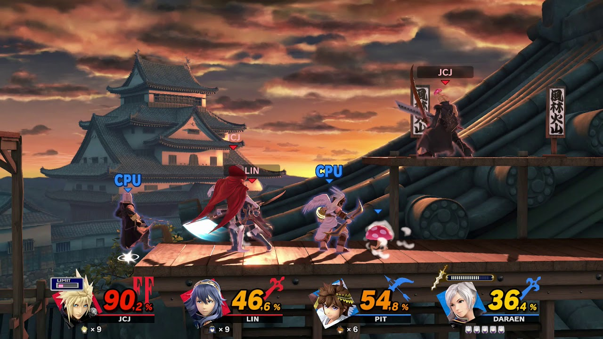

At the start of the game, the 2 players will get a chance to choose a character that will represent them during the fight. Characters are taken directly (copied, if you will) from the popular animated series Attack on Titan, inspired by the graphic novel series written by Hajime Isayama. After choosing their characters, players will be asked to confirm their choice and upon confirming, will begin playing.

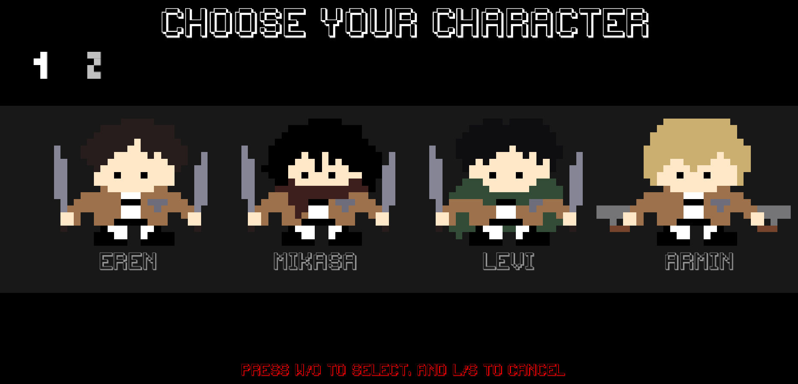

The game has 3 main mechanics that make up gameplay and scoring. 

The first is acceleration. Characters move around by flying around, in movements similar to those seen in the show, Attack on Titan. They can aim a directional indicator, moving it up and down with w/o and s/l, respectively. The d/k and a/; keys make the player face right and left, respectively. Upon pressing e/p, the players will accelerate in the direction of the arrow, but their motion can be impeded by gravity, friction and the barriers on either side of the screen.

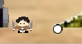
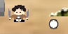
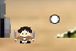

The second is a grappling hook. To counter the extreme acceleration of the e/p key, players can press x/. to release a grappling hook that can help to stop their motion. Of course, moving at high speeds while interacting with stationary objects can cause undesireable effects, like being flung by elastic force, or the string not working and flinging the player to the ground. However, it is a crucial aspect of the game, in order to increase precision of movement, to make the third aspect of the game work.

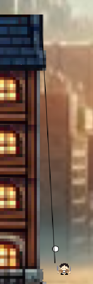

The third is the attacking system. Players have a set amount of health, 200 HP. Holding down the q/i keys, they can damage the other player at 1 HP per tick. However, the timing needs to be accurate. Due to the nature of conditional operators and user input methods, only one person can attack at a time, creating a need for timing in this game, in order to achieve mastery. Players can only damage the other player when they are within range on the left and right sides of them. When one player loses all their HP, they lose and the other player wins.

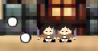
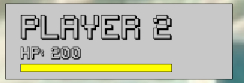
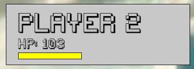
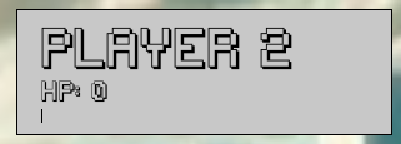
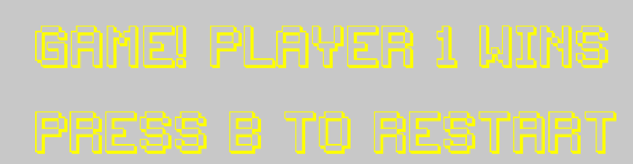

Some limitations to note:
- If too many keys are pressed at the same time, some functions may fail
- The game will sometimes crash when players reach incredibly high speeds (which doesn't happen very often)
- Choosing diffferent characters does not do anything